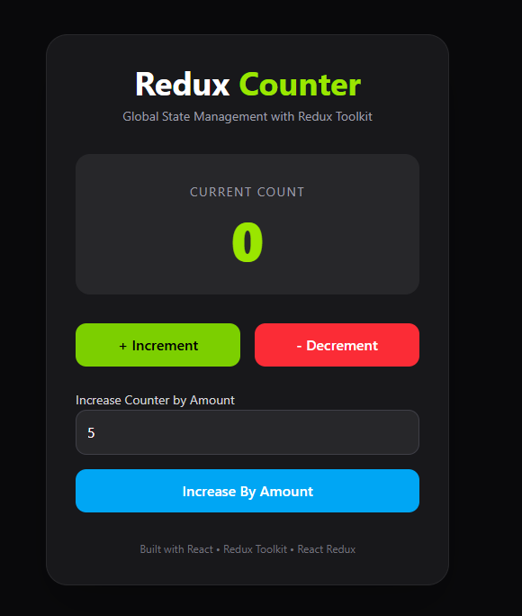

# 🚀 Redux Counter App

A simple and beginner-friendly Counter Application built using **React**, **Redux Toolkit**, and **React Redux**.

This project demonstrates how Redux Toolkit manages global state efficiently while keeping the code clean and maintainable.

---

## 📸 Preview



---

## ✨ Features

- ➕ Increment Counter
- ➖ Decrement Counter
- 🔢 Increase Counter by Custom Amount
- 🌍 Global State Management
- ⚡ Built with Redux Toolkit
- 🎯 Modern Responsive UI

---

## 🛠 Tech Stack

- React
- Redux Toolkit
- React Redux
- Tailwind CSS
- Vite

---

# 📂 Project Structure

```text
src
│
├── redux
│   ├── store.js
│   └── features
│       └── counterSlice.js
│
├── App.jsx
├── main.jsx
└── index.css
```

---

# ⚙️ How It Works

This project uses **Redux Toolkit** to manage the counter state globally.
Instead of storing the counter value inside a React component using `useState`, the counter value is stored inside the **Redux Store**.
The application follows this flow:

```
User Click
     │
     ▼
dispatch(Action)
     │
     ▼
Reducer Updates State
     │
     ▼
Redux Store
     │
     ▼
useSelector Reads Updated State
     │
     ▼
React Re-renders UI
```

---

## 🏪 Redux Store

The Redux Store acts as the central place where the application's global state is stored.

In this project, the store contains one slice:

```js
{
  counter: {
    value: 0;
  }
}
```

---

## 🍰 Counter Slice

The Counter Slice is responsible for managing all counter-related logic.

It contains:

- Initial State
- Reducers
- Automatically Generated Actions

Reducers included:

- increment()
- decrement()
- incrementByAmount()

Redux Toolkit automatically generates the corresponding action creators.

---

## 📖 useSelector()

The `useSelector()` hook is used to read data from the Redux Store.

```js
const count = useSelector((state) => state.counter.value);
```

Whenever the counter value changes, React automatically updates the UI.

---

## 🚀 useDispatch()

The `useDispatch()` hook is used to send actions to Redux.

Example:

```js
dispatch(increment());
```

The dispatched action is received by the reducer, which updates the state inside the Redux Store.

---

## 🔄 Complete Data Flow

```
Button Click

↓

dispatch(increment())

↓

Counter Reducer

↓

Redux Store Updates

↓

useSelector()

↓

Component Re-renders

↓

Updated Counter Visible
```

---

## 🎯 What I Learned

During this project I learned:

- Global State Management
- Redux Store
- createSlice()
- configureStore()
- Provider
- useSelector()
- useDispatch()
- Reducers
- Actions
- Predictable Data Flow

---

## 🚀 Installation

Clone the repository

```bash
git clone <https://github.com/satyasheel87/React-Projects.git>
```

Move into the project

```bash
cd redux-counter-app
```

Install dependencies

```bash
npm install
```

Start the development server

```bash
npm run dev
```

---

## 📚 Documentation

I also created detailed notes explaining Redux Toolkit from basics to implementation.

👉 **Notion Documentation**

[Notion documentation link here.](https://app.notion.com/p/Redux-Docs-by-Satyasheel-gautam-3a8859b85b8d80c8b8ebee24300760de)

---

## ⭐ Future Improvements

- Reset Button
- Dark / Light Theme
- Async Counter
- Redux DevTools Demonstration
- Multiple Redux Slices

---

## 👨‍💻 Author

**Satyasheel Gautam**

Learning React • Redux Toolkit • JavaScript • MERN Stack
